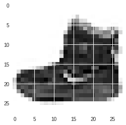
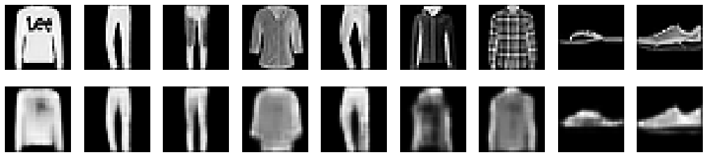
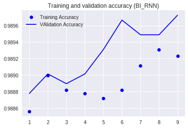
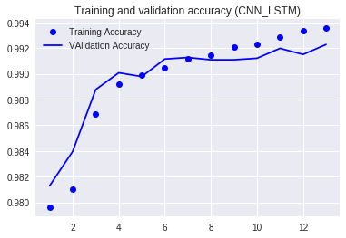

# Homework 2


```
!pip install -q pydot 
!apt-get install graphviz
!pip install -q boto3
```


```
from keras.models import  Sequential, Model, model_from_json, load_model
from keras.layers import Input, Dense, Conv2D, MaxPooling2D, UpSampling2D
from keras import regularizers
from keras import backend as K
from keras.preprocessing import sequence
import tensorflow as tf
import numpy as np
import copy
import pandas as pd
import matplotlib.pyplot as plt
from keras.layers.core import Dense, Dropout, Activation, Lambda,Flatten, Reshape
from keras.optimizers import SGD, Adam, RMSprop
from keras.utils import np_utils
from keras.regularizers import l2
from keras.layers import Input, ELU, LSTM, Embedding, Convolution2D, MaxPooling2D, \
BatchNormalization, Convolution1D, MaxPooling1D, concatenate
from keras.layers.convolutional import Conv2D, MaxPooling2D, ZeroPadding2D, AveragePooling2D
from keras.callbacks import EarlyStopping
from keras.preprocessing.image import ImageDataGenerator
from keras.layers.normalization import BatchNormalization
from keras import backend as K
from PIL import Image
from keras.applications import VGG16
from keras.applications.vgg16 import preprocess_input
from sklearn.model_selection import train_test_split
from keras.layers import Bidirectional, SimpleRNN

import pandas as pd
import numpy as np
import boto3
import re, os
from string import printable
import pydot

from pathlib import Path
import json

import warnings
warnings.filterwarnings("ignore")

from tensorflow.python.client import device_lib

from keras.utils import plot_model # pydot, graphviz are dependencies
from keras.utils.vis_utils import model_to_dot
from keras.callbacks import TensorBoard, ModelCheckpoint


# -Plot libs-
import matplotlib.pyplot as plt
from IPython.display import SVG, display

import matplotlib.pyplot as plt
%matplotlib inline
```

## 1. Autoencoder

First, I loaded the mnist fashion dataset.


```
(x_train, y_train), (x_test, y_test) = tf.keras.datasets.fashion_mnist.load_data()
```

    Downloading data from https://storage.googleapis.com/tensorflow/tf-keras-datasets/train-labels-idx1-ubyte.gz
    32768/29515 [=================================] - 0s 0us/step
    Downloading data from https://storage.googleapis.com/tensorflow/tf-keras-datasets/train-images-idx3-ubyte.gz
    26427392/26421880 [==============================] - 0s 0us/step
    Downloading data from https://storage.googleapis.com/tensorflow/tf-keras-datasets/t10k-labels-idx1-ubyte.gz
    8192/5148 [===============================================] - 0s 0us/step
    Downloading data from https://storage.googleapis.com/tensorflow/tf-keras-datasets/t10k-images-idx3-ubyte.gz
    4423680/4422102 [==============================] - 0s 0us/step
    

An example of these pictures is as below.


```
plt.imshow(x_train[0])
```


    <matplotlib.image.AxesImage at 0x7fafb30d3908>





Reshape the dataset.


```
x_train = x_train.astype('float32') / 255
x_test = x_test.astype('float32') / 255
x_train = np.reshape(x_train, (len(x_train), 28, 28, 1))  # adapt this if using `channels_first` image data format
x_test = np.reshape(x_test, (len(x_test), 28, 28, 1)) 
```

Build the auto-encoder.


```
input_img = Input(shape=(28, 28, 1))  # adapt this if using `channels_first` image data format
x = Conv2D(16, (3, 3), activation='relu', padding='same')(input_img)
x = MaxPooling2D((2, 2), padding='same')(x)
x = Conv2D(8, (3, 3), activation='relu', padding='same')(x)
x = MaxPooling2D((2, 2), padding='same')(x)
x = Conv2D(8, (3, 3), activation='relu', padding='same')(x)
encoded = MaxPooling2D((2, 2), padding='same')(x)

# at this point the representation is (4, 4, 8) i.e. 128-dimensional

x = Conv2D(8, (3, 3), activation='relu', padding='same')(encoded)
x = UpSampling2D((2, 2))(x)
x = Conv2D(8, (3, 3), activation='relu', padding='same')(x)
x = UpSampling2D((2, 2))(x)
x = Conv2D(16, (3, 3), activation='relu')(x)
x = UpSampling2D((2, 2))(x)
decoded = Conv2D(1, (3, 3), activation='sigmoid', padding='same')(x)

autoencoder = Model(input_img, decoded)
autoencoder.compile(optimizer='adadelta', loss='binary_crossentropy')
```


```
autoencoder.fit(x_train, x_train,
                epochs=50,
                batch_size=128,
                shuffle=True,
                validation_data=(x_test, x_test),
                callbacks=[TensorBoard(log_dir='/tmp/autoencoder')])
```

    Train on 60000 samples, validate on 10000 samples
    Epoch 1/50
    60000/60000 [==============================] - 11s 184us/step - loss: 0.3684 - val_loss: 0.3299
    Epoch 2/50
    60000/60000 [==============================] - 8s 138us/step - loss: 0.3201 - val_loss: 0.3120
    Epoch 3/50
    60000/60000 [==============================] - 8s 133us/step - loss: 0.3116 - val_loss: 0.3173
    Epoch 4/50
    60000/60000 [==============================] - 8s 132us/step - loss: 0.3070 - val_loss: 0.3073
    Epoch 5/50
    60000/60000 [==============================] - 8s 134us/step - loss: 0.3041 - val_loss: 0.3086
    Epoch 6/50
    60000/60000 [==============================] - 8s 134us/step - loss: 0.3020 - val_loss: 0.3044
    Epoch 7/50
    60000/60000 [==============================] - 9s 145us/step - loss: 0.3003 - val_loss: 0.3014
    Epoch 8/50
    60000/60000 [==============================] - 9s 146us/step - loss: 0.2990 - val_loss: 0.2977
    Epoch 9/50
    60000/60000 [==============================] - 9s 146us/step - loss: 0.2975 - val_loss: 0.3111
    Epoch 10/50
    60000/60000 [==============================] - 9s 144us/step - loss: 0.2963 - val_loss: 0.2975
    Epoch 11/50
    60000/60000 [==============================] - 9s 143us/step - loss: 0.2954 - val_loss: 0.2981
    Epoch 12/50
    60000/60000 [==============================] - 10s 170us/step - loss: 0.2948 - val_loss: 0.2943
    Epoch 13/50
    60000/60000 [==============================] - 9s 155us/step - loss: 0.2936 - val_loss: 0.2978
    Epoch 14/50
    60000/60000 [==============================] - 9s 143us/step - loss: 0.2932 - val_loss: 0.2953
    Epoch 15/50
    60000/60000 [==============================] - 8s 134us/step - loss: 0.2928 - val_loss: 0.2945
    Epoch 16/50
    60000/60000 [==============================] - 9s 151us/step - loss: 0.2919 - val_loss: 0.2933
    Epoch 17/50
    60000/60000 [==============================] - 10s 160us/step - loss: 0.2914 - val_loss: 0.2957
    Epoch 18/50
    60000/60000 [==============================] - 10s 159us/step - loss: 0.2910 - val_loss: 0.2946
    Epoch 19/50
    60000/60000 [==============================] - 10s 165us/step - loss: 0.2906 - val_loss: 0.2939
    Epoch 20/50
    60000/60000 [==============================] - 10s 166us/step - loss: 0.2903 - val_loss: 0.2903
    Epoch 21/50
    60000/60000 [==============================] - 10s 165us/step - loss: 0.2897 - val_loss: 0.2921
    Epoch 22/50
    60000/60000 [==============================] - 10s 165us/step - loss: 0.2896 - val_loss: 0.2927
    Epoch 23/50
    60000/60000 [==============================] - 10s 163us/step - loss: 0.2895 - val_loss: 0.2898
    Epoch 24/50
    60000/60000 [==============================] - 10s 166us/step - loss: 0.2892 - val_loss: 0.2900
    Epoch 25/50
    60000/60000 [==============================] - 10s 167us/step - loss: 0.2889 - val_loss: 0.2945
    Epoch 26/50
    60000/60000 [==============================] - 10s 172us/step - loss: 0.2885 - val_loss: 0.2900
    Epoch 27/50
    60000/60000 [==============================] - 11s 180us/step - loss: 0.2879 - val_loss: 0.2886
    Epoch 28/50
    60000/60000 [==============================] - 10s 171us/step - loss: 0.2878 - val_loss: 0.2901
    Epoch 29/50
    60000/60000 [==============================] - 10s 167us/step - loss: 0.2877 - val_loss: 0.2890
    Epoch 30/50
    60000/60000 [==============================] - 10s 167us/step - loss: 0.2877 - val_loss: 0.2906
    Epoch 31/50
    60000/60000 [==============================] - 10s 167us/step - loss: 0.2870 - val_loss: 0.2906
    Epoch 32/50
    60000/60000 [==============================] - 10s 164us/step - loss: 0.2869 - val_loss: 0.2866
    Epoch 33/50
    60000/60000 [==============================] - 10s 164us/step - loss: 0.2870 - val_loss: 0.2897
    Epoch 34/50
    60000/60000 [==============================] - 10s 163us/step - loss: 0.2869 - val_loss: 0.2879
    Epoch 35/50
    60000/60000 [==============================] - 10s 164us/step - loss: 0.2864 - val_loss: 0.2862
    Epoch 36/50
    60000/60000 [==============================] - 10s 164us/step - loss: 0.2861 - val_loss: 0.2895
    Epoch 37/50
    60000/60000 [==============================] - 10s 164us/step - loss: 0.2858 - val_loss: 0.2857
    Epoch 38/50
    60000/60000 [==============================] - 10s 170us/step - loss: 0.2855 - val_loss: 0.2877
    Epoch 39/50
    60000/60000 [==============================] - 10s 169us/step - loss: 0.2852 - val_loss: 0.2887
    Epoch 40/50
    60000/60000 [==============================] - 10s 160us/step - loss: 0.2854 - val_loss: 0.2875
    Epoch 41/50
    60000/60000 [==============================] - 9s 155us/step - loss: 0.2853 - val_loss: 0.2881
    Epoch 42/50
    60000/60000 [==============================] - 9s 149us/step - loss: 0.2850 - val_loss: 0.2874
    Epoch 43/50
    60000/60000 [==============================] - 8s 141us/step - loss: 0.2847 - val_loss: 0.2873
    Epoch 44/50
    60000/60000 [==============================] - 8s 133us/step - loss: 0.2850 - val_loss: 0.2922
    Epoch 45/50
    60000/60000 [==============================] - 8s 128us/step - loss: 0.2847 - val_loss: 0.2866
    Epoch 46/50
    60000/60000 [==============================] - 8s 128us/step - loss: 0.2846 - val_loss: 0.2874
    Epoch 47/50
    60000/60000 [==============================] - 8s 130us/step - loss: 0.2846 - val_loss: 0.2892
    Epoch 48/50
    60000/60000 [==============================] - 8s 128us/step - loss: 0.2848 - val_loss: 0.2871
    Epoch 49/50
    60000/60000 [==============================] - 8s 134us/step - loss: 0.2846 - val_loss: 0.2853
    Epoch 50/50
    60000/60000 [==============================] - 9s 147us/step - loss: 0.2846 - val_loss: 0.2859
    


    <keras.callbacks.History at 0x7fafb082be80>


Now, we can use the autoencoders to present the decoded reconstruction of each fashion item. I think this method is more potent than PCA.


```
decoded_imgs = autoencoder.predict(x_test)

n = 10
plt.figure(figsize=(20, 4))
for i in range(1,n):
    # display original
    ax = plt.subplot(2, n, i)
    plt.imshow(x_test[i].reshape(28, 28))
    plt.gray()
    ax.get_xaxis().set_visible(False)
    ax.get_yaxis().set_visible(False)

    # display reconstruction
    ax = plt.subplot(2, n, i + n)
    plt.imshow(decoded_imgs[i].reshape(28, 28))
    plt.gray()
    ax.get_xaxis().set_visible(False)
    ax.get_yaxis().set_visible(False)
plt.show()
```





## 2. Image Classification

### 2.1 Deep CNN


```
(x_train, y_train), (x_test, y_test) = tf.keras.datasets.fashion_mnist.load_data()
```


```
x_train = x_train.reshape(x_train.shape[0], 28, 28,1).astype('float32') / 255
x_test = x_test.reshape(x_test.shape[0], 28, 28,1).astype('float32') / 255
```

We need to convert the target response to numerical categories to train our model


```
from keras.utils import np_utils
y_train = np_utils.to_categorical(y_train, 10)
y_test = np_utils.to_categorical(y_test, 10)
```

Use LeNet Architecture to do the image classification.


```
# =============================
#  Setting up LeNet Architecture
# ============================
model = Sequential()

model.add(Conv2D(filters = 32,kernel_size=(3, 3), 
                 activation='relu', strides=(1, 1), 
                 padding='valid', input_shape=(28,28,1)))
model.add(MaxPooling2D(pool_size=(2, 2)))

model.add(Conv2D(filters = 32,kernel_size=(3, 3), 
                 activation='relu', strides=(1, 1), 
                 padding='valid', input_shape=(28,28,1)))
model.add(MaxPooling2D(pool_size=(2, 2)))
model.add(Dropout(0.5))

model.add(Conv2D(filters = 32,kernel_size=(3, 3), 
                 activation='relu', strides=(1, 1), 
                 padding='valid', input_shape=(28,28,1)))

model.add(Flatten())
model.add(Dense(84))
model.add(Dense(10))
model.add(Activation('softmax'))
```


```
l_rate = 1
sgd = SGD(lr=l_rate, momentum=0.0, decay=0.0, nesterov=False)
# model.compile(loss='categorical_crossentropy', optimizer=sgd,metrics=['accuracy']) -takes a long time to converge
model.compile(loss='categorical_crossentropy', optimizer='adam',metrics=['accuracy'])
model.fit(x_train, y_train, epochs=10,
          verbose=2, validation_data=(x_test, y_test))
```

    Train on 60000 samples, validate on 10000 samples
    Epoch 1/10
     - 56s - loss: 0.6051 - acc: 0.7763 - val_loss: 0.4097 - val_acc: 0.8487
    Epoch 2/10
     - 54s - loss: 0.4133 - acc: 0.8477 - val_loss: 0.3453 - val_acc: 0.8747
    Epoch 3/10
     - 54s - loss: 0.3679 - acc: 0.8654 - val_loss: 0.3168 - val_acc: 0.8869
    Epoch 4/10
     - 53s - loss: 0.3457 - acc: 0.8726 - val_loss: 0.3174 - val_acc: 0.8833
    Epoch 5/10
     - 53s - loss: 0.3283 - acc: 0.8806 - val_loss: 0.3135 - val_acc: 0.8862
    Epoch 6/10
     - 54s - loss: 0.3159 - acc: 0.8828 - val_loss: 0.2830 - val_acc: 0.8960
    Epoch 7/10
     - 54s - loss: 0.3072 - acc: 0.8857 - val_loss: 0.2820 - val_acc: 0.8975
    Epoch 8/10
     - 53s - loss: 0.3029 - acc: 0.8884 - val_loss: 0.2949 - val_acc: 0.8924
    Epoch 9/10
     - 53s - loss: 0.2939 - acc: 0.8906 - val_loss: 0.2746 - val_acc: 0.8988
    Epoch 10/10
     - 53s - loss: 0.2885 - acc: 0.8924 - val_loss: 0.2795 - val_acc: 0.8952
    


    <keras.callbacks.History at 0x7f3472328ef0>


```
print("Testing accuracy = %0.05f" % model.evaluate(x_test, y_test)[1])
```

    10000/10000 [==============================] - 3s 306us/step
    Testing accuracy = 0.89520
    


```
print("Training accuracy = %0.05f" % model.evaluate(x_train, y_train)[1])
```

    60000/60000 [==============================] - 19s 311us/step
    Training accuracy = 0.91215
    

The performance of this model is sound. The test accuracy is close to the training accuracy. Hence, I do not think the problem of overfitting exists in this case.

### 2.2 Transfer Learning

In this section, I used the VGG to do the transfer learning. Notice that the VGG requires an input of three channels and 48*48 pixels. Hence, I reshape the dataset to (length, 48, 48, 3)


```
(x_train, y_train), (x_test, y_test) = tf.keras.datasets.fashion_mnist.load_data()
```


```
x_train= np.reshape(x_train, (len(x_train), 28*28))
x_train = np.dstack([x_train] * 3)
x_test= np.reshape(x_test, (len(x_test), 28*28))
x_test = np.dstack([x_test] * 3)
x_train = x_train.reshape(-1, 28,28,3)
x_test= x_test.reshape (-1,28,28,3)
x_train.shape,x_test.shape
```


    ((60000, 28, 28, 3), (10000, 28, 28, 3))


```
# Reshape image to (48,48)
from keras.preprocessing.image import img_to_array, array_to_img
x_train = np.asarray([img_to_array(array_to_img(im, scale=False).resize((48,48))) for im in x_train])
x_test = np.asarray([img_to_array(array_to_img(im, scale=False).resize((48,48))) for im in x_test])
x_train.shape, x_test.shape
```


    ((60000, 48, 48, 3), (10000, 48, 48, 3))


```
x_train = x_train.astype('float32') / 255
x_test = x_test.astype('float32') / 255
y_train = np_utils.to_categorical(y_train, 10)
y_test = np_utils.to_categorical(y_test, 10)
```

Build the transfer learning model. Notice that we only train the last layer. Hence, we set the layer.trainable parameter to false.


```
number_of_classes = 10

vgg = VGG16(weights = "imagenet", include_top=False,  input_shape=(48, 48, 3) ,pooling='max', classes=number_of_classes)


for layer in vgg.layers[:17]:
    layer.trainable = False

x = vgg.output
x = Dense(1024, activation="relu")(x)
x = Dropout(0.5)(x)
x = Dense(1024, activation="relu")(x)
predictions = Dense(number_of_classes, activation="softmax")(x)

# creating the final model 
vgg_model = Model(inputs = vgg.input, outputs = predictions)
```


```
vgg_model.summary()
```

    _________________________________________________________________
    Layer (type)                 Output Shape              Param #   
    =================================================================
    input_6 (InputLayer)         (None, 48, 48, 3)         0         
    _________________________________________________________________
    block1_conv1 (Conv2D)        (None, 48, 48, 64)        1792      
    _________________________________________________________________
    block1_conv2 (Conv2D)        (None, 48, 48, 64)        36928     
    _________________________________________________________________
    block1_pool (MaxPooling2D)   (None, 24, 24, 64)        0         
    _________________________________________________________________
    block2_conv1 (Conv2D)        (None, 24, 24, 128)       73856     
    _________________________________________________________________
    block2_conv2 (Conv2D)        (None, 24, 24, 128)       147584    
    _________________________________________________________________
    block2_pool (MaxPooling2D)   (None, 12, 12, 128)       0         
    _________________________________________________________________
    block3_conv1 (Conv2D)        (None, 12, 12, 256)       295168    
    _________________________________________________________________
    block3_conv2 (Conv2D)        (None, 12, 12, 256)       590080    
    _________________________________________________________________
    block3_conv3 (Conv2D)        (None, 12, 12, 256)       590080    
    _________________________________________________________________
    block3_pool (MaxPooling2D)   (None, 6, 6, 256)         0         
    _________________________________________________________________
    block4_conv1 (Conv2D)        (None, 6, 6, 512)         1180160   
    _________________________________________________________________
    block4_conv2 (Conv2D)        (None, 6, 6, 512)         2359808   
    _________________________________________________________________
    block4_conv3 (Conv2D)        (None, 6, 6, 512)         2359808   
    _________________________________________________________________
    block4_pool (MaxPooling2D)   (None, 3, 3, 512)         0         
    _________________________________________________________________
    block5_conv1 (Conv2D)        (None, 3, 3, 512)         2359808   
    _________________________________________________________________
    block5_conv2 (Conv2D)        (None, 3, 3, 512)         2359808   
    _________________________________________________________________
    block5_conv3 (Conv2D)        (None, 3, 3, 512)         2359808   
    _________________________________________________________________
    block5_pool (MaxPooling2D)   (None, 1, 1, 512)         0         
    _________________________________________________________________
    global_max_pooling2d_3 (Glob (None, 512)               0         
    _________________________________________________________________
    dense_11 (Dense)             (None, 1024)              525312    
    _________________________________________________________________
    dropout_7 (Dropout)          (None, 1024)              0         
    _________________________________________________________________
    dense_12 (Dense)             (None, 1024)              1049600   
    _________________________________________________________________
    dense_13 (Dense)             (None, 10)                10250     
    =================================================================
    Total params: 16,299,850
    Trainable params: 3,944,970
    Non-trainable params: 12,354,880
    _________________________________________________________________
    


```
# Training the model
batch_size = 150
epochs = 5
#model = create_model()
vgg_model.compile(optimizer='adam',loss='categorical_crossentropy',metrics=['accuracy'])
history = vgg_model.fit(x_train, y_train,
                    batch_size=batch_size,
                    epochs=epochs,
                    verbose=1,
validation_data=(x_test, y_test))
```

    Train on 60000 samples, validate on 10000 samples
    Epoch 1/5
    60000/60000 [==============================] - 1896s 32ms/step - loss: 0.4489 - acc: 0.8383 - val_loss: 0.3410 - val_acc: 0.8801
    Epoch 2/5
    60000/60000 [==============================] - 1901s 32ms/step - loss: 0.3182 - acc: 0.8853 - val_loss: 0.3386 - val_acc: 0.8769
    Epoch 3/5
    60000/60000 [==============================] - 1891s 32ms/step - loss: 0.2858 - acc: 0.8954 - val_loss: 0.3003 - val_acc: 0.8917
    Epoch 4/5
    60000/60000 [==============================] - 1896s 32ms/step - loss: 0.2667 - acc: 0.9030 - val_loss: 0.2997 - val_acc: 0.8881
    Epoch 5/5
    60000/60000 [==============================] - 1890s 31ms/step - loss: 0.2486 - acc: 0.9085 - val_loss: 0.2969 - val_acc: 0.8980
    


```
print("Training accuracy = %0.05f" % vgg_model.evaluate(x_train, y_train)[1])
print("Testing accuracy = %0.05f" % vgg_model.evaluate(x_test, y_test)[1])
```

    60000/60000 [==============================] - 1557s 26ms/step
    Training accuracy = 0.91668
    10000/10000 [==============================] - 259s 26ms/step
    Testing accuracy = 0.89800
    


```
vgg_model.save('my_vgg_model.h5') 
```

In this case, the performance of transfer learning is a little bit higher than the deep CNN. However, it takes me a lot of time to train the model.

## 3. Text Classification


```
benign = pd.read_csv("https://s3.amazonaws.com/anly-590/url-classification/benign-urls.txt" , header = None)
malicious =  pd.read_csv("https://s3.amazonaws.com/anly-590/url-classification/malicious-urls.txt", header = None)
```

### 3.1 Bidirectional RNN

First, I built a data frame to store all the URLs and their categories.


```
benign = benign.drop([0])
malicious = malicious.rename(columns = {0:"URL"})
benign = benign.rename(columns = {0:"URL"})
benign['Is_Malicious'] = 0
malicious['Is_Malicious'] = 1
```


```
df = pd.concat([benign, malicious])
```


```
df.head()
```


<div>
<style scoped>
    .dataframe tbody tr th:only-of-type {
        vertical-align: middle;
    }

    .dataframe tbody tr th {
        vertical-align: top;
    }

    .dataframe thead th {
        text-align: right;
    }
</style>
<table border="1" class="dataframe">
  <thead>
    <tr style="text-align: right;">
      <th></th>
      <th>URL</th>
      <th>Is_Malicious</th>
    </tr>
  </thead>
  <tbody>
    <tr>
      <th>1</th>
      <td>.0.blogger.gmodules.com</td>
      <td>0</td>
    </tr>
    <tr>
      <th>2</th>
      <td>.0.client-channel.google.com</td>
      <td>0</td>
    </tr>
    <tr>
      <th>3</th>
      <td>.0.docs.google.com</td>
      <td>0</td>
    </tr>
    <tr>
      <th>4</th>
      <td>.0.drive.google.com</td>
      <td>0</td>
    </tr>
    <tr>
      <th>5</th>
      <td>.0.gvt0.cn</td>
      <td>0</td>
    </tr>
  </tbody>
</table>
</div>


I built tokens due to the printable characters. Then, I applied padding to each URL. 


```
# Data preprocessing

# Convert The URLs to indices of printable characters
url_tokens = [[printable.index(x) + 1 for x in url if x in printable] for url in df.URL]

# maximal lenghth and padding
max_len=75
X = sequence.pad_sequences(url_tokens, maxlen=max_len)
 
# get the response
y = np.array(df.Is_Malicious)

print('Matrix dimensions of X: ', X.shape, 'Vector dimension of response: ', y.shape)
```

    Matrix dimensions of X:  (67352, 75) Vector dimension of response:  (67352,)
    


```
X_train, X_test, y_train, y_test = train_test_split(X, y, test_size=0.25, random_state=3)
```

In this case, I used the Bidirectional RNN to do the classification.


```
# Input
max_len=75
emb_dim=32
max_vocab_len=100
output_size=32
W_reg=regularizers.l2(1e-4)

inp = Input(shape=(max_len,),dtype='int32')

x = Embedding(input_dim=max_vocab_len, output_dim=emb_dim, input_length=max_len, W_regularizer=W_reg)(inp) 
x = Bidirectional(SimpleRNN(100, 
                             return_sequences=False, 
                             dropout=0.1, 
                             recurrent_dropout=0.1))(x)
x = Dense(1, activation='sigmoid')(x)

# Setting the model
model1 = Model(inputs=inp, outputs=x)
adam = Adam(lr=1e-4, beta_1=0.9, beta_2=0.999, epsilon=1e-08, decay=0.0)
model1.compile(optimizer=adam, loss='binary_crossentropy', metrics=['accuracy'])
model1.summary()
```

    _________________________________________________________________
    Layer (type)                 Output Shape              Param #   
    =================================================================
    input_8 (InputLayer)         (None, 75)                0         
    _________________________________________________________________
    embedding_5 (Embedding)      (None, 75, 32)            3200      
    _________________________________________________________________
    bidirectional_3 (Bidirection (None, 200)               26600     
    _________________________________________________________________
    dense_15 (Dense)             (None, 1)                 201       
    =================================================================
    Total params: 30,001
    Trainable params: 30,001
    Non-trainable params: 0
    _________________________________________________________________
    


```
cwd = os.getcwd()
epochs = 20
batch_size = 32

# early stopping
callbacks = [EarlyStopping(monitor='val_loss', patience=2),
             ModelCheckpoint(filepath='Best_BI_RNN_model.h5', monitor='val_loss', save_best_only=True)]


history1 = model1.fit(X_train, y_train, epochs=epochs, 
                      batch_size=batch_size, 
                      validation_data=(X_test, y_test),
                     callbacks=callbacks)

loss, accuracy = model1.evaluate(X_train, y_train, verbose=1)
print('\nTraining Accuracy = ', accuracy, '\n')

loss, accuracy = model1.evaluate(X_test, y_test, verbose=1)
print('\nTesting Accuracy =', accuracy, '\n')

```

    Train on 50514 samples, validate on 16838 samples
    Epoch 1/20
    50514/50514 [==============================] - 73s 1ms/step - loss: 0.0250 - acc: 0.9886 - val_loss: 0.0225 - val_acc: 0.9888
    Epoch 2/20
    50514/50514 [==============================] - 73s 1ms/step - loss: 0.0245 - acc: 0.9890 - val_loss: 0.0223 - val_acc: 0.9890
    Epoch 3/20
    50514/50514 [==============================] - 73s 1ms/step - loss: 0.0244 - acc: 0.9888 - val_loss: 0.0220 - val_acc: 0.9889
    Epoch 4/20
    50514/50514 [==============================] - 73s 1ms/step - loss: 0.0250 - acc: 0.9888 - val_loss: 0.0219 - val_acc: 0.9890
    Epoch 5/20
    50514/50514 [==============================] - 74s 1ms/step - loss: 0.0246 - acc: 0.9887 - val_loss: 0.0218 - val_acc: 0.9893
    Epoch 6/20
    50514/50514 [==============================] - 73s 1ms/step - loss: 0.0242 - acc: 0.9888 - val_loss: 0.0218 - val_acc: 0.9897
    Epoch 7/20
    50514/50514 [==============================] - 73s 1ms/step - loss: 0.0239 - acc: 0.9891 - val_loss: 0.0214 - val_acc: 0.9895
    Epoch 8/20
    50514/50514 [==============================] - 73s 1ms/step - loss: 0.0237 - acc: 0.9893 - val_loss: 0.0222 - val_acc: 0.9895
    Epoch 9/20
    50514/50514 [==============================] - 75s 1ms/step - loss: 0.0236 - acc: 0.9892 - val_loss: 0.0218 - val_acc: 0.9897
    50514/50514 [==============================] - 21s 409us/step
    
    Training Accuracy =  0.9914875084135091 
    
    16838/16838 [==============================] - 7s 411us/step
    
    Testing Accuracy = 0.9897256206200261 
    
    


```
## Using Different URLs to test the model
test_url_mal = ".btscene2.com"
test_url_benign = "www.yahoo.com"
```


```
def test_url(url, model):
  # Step 1: Convert raw URL string in list of lists where characters that are contained in "printable" are stored encoded as integer 
  url_int_tokens = [[printable.index(x) + 1 for x in url if x in printable]]

  # Step 2: Cut URL string at max_len or pad with zeros if shorter
  max_len=75
  X = sequence.pad_sequences(url_int_tokens, maxlen=max_len)
  proba = model.predict(X, batch_size=1)
  if proba > 0.5:
        result = "malicious"
  else:
        result = "benign"
  print("Test URL:", url, "is",result)
```


```
test_url(test_url_mal,model1)
test_url(test_url_benign,model1)
```

    Test URL: .btscene2.com is malicious
    Test URL: www.yahoo.com is benign
    

The training and testing accuracies are very high, which shows that our model can efficiently detect most malicious URLs.

### 3.2 CNN + LSTM


```
# Input
max_len=75
emb_dim=32
max_vocab_len=100
output_size=32
W_reg=regularizers.l2(1e-4)

inp = Input(shape=(max_len,),dtype='int32')

x = Embedding(input_dim=max_vocab_len, output_dim=emb_dim, input_length=max_len, W_regularizer=W_reg)(inp) 

# CNN
x =Convolution1D(kernel_size=5, filters=256, border_mode='same')(x)
x = ELU()(x)
x = MaxPooling1D(pool_size=4)(x)
x = Dropout(0.1)(x)

# LSTM
x = LSTM(output_size)(x)
x = Dropout(0.1)(x)
x = Dense(1, activation='sigmoid')(x)

# Setting the model
model2 = Model(inputs=inp, outputs=x)
adam = Adam(lr=1e-4, beta_1=0.9, beta_2=0.999, epsilon=1e-08, decay=0.0)
model2.compile(optimizer=adam, loss='binary_crossentropy', metrics=['accuracy'])
model2.summary()
```

    _________________________________________________________________
    Layer (type)                 Output Shape              Param #   
    =================================================================
    input_9 (InputLayer)         (None, 75)                0         
    _________________________________________________________________
    embedding_6 (Embedding)      (None, 75, 32)            3200      
    _________________________________________________________________
    conv1d_3 (Conv1D)            (None, 75, 256)           41216     
    _________________________________________________________________
    elu_3 (ELU)                  (None, 75, 256)           0         
    _________________________________________________________________
    max_pooling1d_3 (MaxPooling1 (None, 18, 256)           0         
    _________________________________________________________________
    dropout_8 (Dropout)          (None, 18, 256)           0         
    _________________________________________________________________
    lstm_2 (LSTM)                (None, 32)                36992     
    _________________________________________________________________
    dropout_9 (Dropout)          (None, 32)                0         
    _________________________________________________________________
    dense_16 (Dense)             (None, 1)                 33        
    =================================================================
    Total params: 81,441
    Trainable params: 81,441
    Non-trainable params: 0
    _________________________________________________________________
    


```
cwd = os.getcwd()
epochs = 20
batch_size = 32

# early stopping
callbacks = [EarlyStopping(monitor='val_loss', patience=2),
             ModelCheckpoint(filepath='Best_CNN_LSTM_model.h5', monitor='val_loss', save_best_only=True)]


history2 = model2.fit(X_train, y_train, epochs=epochs, 
                      batch_size=batch_size, 
                      validation_data=(X_test, y_test),
                     callbacks=callbacks)
  

loss, accuracy = model2.evaluate(X_train, y_train, verbose=1)
print('\nTraining Accuracy = ', accuracy, '\n')

loss, accuracy = model2.evaluate(X_test, y_test, verbose=1)
print('\nTesting Accuracy =', accuracy, '\n')
```

    Train on 50514 samples, validate on 16838 samples
    Epoch 1/20
    50514/50514 [==============================] - 87s 2ms/step - loss: 0.1104 - acc: 0.9796 - val_loss: 0.0670 - val_acc: 0.9813
    Epoch 2/20
    50514/50514 [==============================] - 85s 2ms/step - loss: 0.0522 - acc: 0.9811 - val_loss: 0.0337 - val_acc: 0.9840
    Epoch 3/20
    50514/50514 [==============================] - 85s 2ms/step - loss: 0.0286 - acc: 0.9869 - val_loss: 0.0237 - val_acc: 0.9888
    Epoch 4/20
    50514/50514 [==============================] - 84s 2ms/step - loss: 0.0233 - acc: 0.9892 - val_loss: 0.0214 - val_acc: 0.9901
    Epoch 5/20
    50514/50514 [==============================] - 84s 2ms/step - loss: 0.0215 - acc: 0.9899 - val_loss: 0.0209 - val_acc: 0.9898
    Epoch 6/20
    50514/50514 [==============================] - 85s 2ms/step - loss: 0.0202 - acc: 0.9904 - val_loss: 0.0200 - val_acc: 0.9912
    Epoch 7/20
    50514/50514 [==============================] - 84s 2ms/step - loss: 0.0194 - acc: 0.9912 - val_loss: 0.0192 - val_acc: 0.9913
    Epoch 8/20
    50514/50514 [==============================] - 83s 2ms/step - loss: 0.0183 - acc: 0.9915 - val_loss: 0.0200 - val_acc: 0.9911
    Epoch 9/20
    50514/50514 [==============================] - 83s 2ms/step - loss: 0.0175 - acc: 0.9921 - val_loss: 0.0187 - val_acc: 0.9911
    Epoch 10/20
    50514/50514 [==============================] - 86s 2ms/step - loss: 0.0168 - acc: 0.9923 - val_loss: 0.0186 - val_acc: 0.9912
    Epoch 11/20
    50514/50514 [==============================] - 84s 2ms/step - loss: 0.0163 - acc: 0.9929 - val_loss: 0.0184 - val_acc: 0.9920
    Epoch 12/20
    50514/50514 [==============================] - 83s 2ms/step - loss: 0.0156 - acc: 0.9934 - val_loss: 0.0189 - val_acc: 0.9915
    Epoch 13/20
    50514/50514 [==============================] - 85s 2ms/step - loss: 0.0151 - acc: 0.9935 - val_loss: 0.0186 - val_acc: 0.9923
    50514/50514 [==============================] - 24s 468us/step
    
    Training Accuracy =  0.9940808488735796 
    
    16838/16838 [==============================] - 8s 489us/step
    
    Testing Accuracy = 0.9922793680959734 
    
    


```
test_url(test_url_mal,model2)
test_url(test_url_benign,model2)
```

    Test URL: .btscene2.com is malicious
    Test URL: www.yahoo.com is benign
    

The CNN+LSTM model's accuracy is higher than the previous one.

### Comparison


```
acc = history1.history['acc']
val_acc = history1.history['val_acc']
loss = history1.history['loss']
val_loss = history1.history['val_loss']

# Plotting the data 

# Training + Valdiation Accuracy
epochs = range(1,len(acc) + 1)
plt.plot( epochs, acc, 'bo', label = 'Training Accuracy')
plt.plot( epochs, val_acc, 'b', label = 'VAlidation Accuracy')
plt.title('Training and validation accuracy (BI_RNN)')
plt.legend()
plt.figure()
```


    <matplotlib.figure.Figure at 0x7f3479066198>





    <matplotlib.figure.Figure at 0x7f3479066198>


```
acc = history2.history['acc']
val_acc = history2.history['val_acc']
loss = history2.history['loss']
val_loss = history2.history['val_loss']

# Plotting the data 

# Training + Valdiation Accuracy
epochs = range(1,len(acc) + 1)
plt.plot( epochs, acc, 'bo', label = 'Training Accuracy')
plt.plot( epochs, val_acc, 'b', label = 'VAlidation Accuracy')
plt.title('Training and validation accuracy (CNN_LSTM)')
plt.legend()
plt.figure()
```


    <matplotlib.figure.Figure at 0x7f346e56dfd0>





    <matplotlib.figure.Figure at 0x7f346e56dfd0>


From these graphs, we can show that the overall performance of CNN_LSTM is better than the BI_RNN. Moreover, the decrease in loss is more stable for CNN_LSTM. However, it takes more epochs to coverage.

## Reference

1. Chollet, F. (2017).* Deep learning with python.* Manning Publications Co..
2. Melissa K. (2017). *Featureless Deep Learning for Detection of Malicious URLs. *https://github.com/incertum/cyber-matrix-ai/tree/master/Malicious-URL-Detection-Deep-Learning
